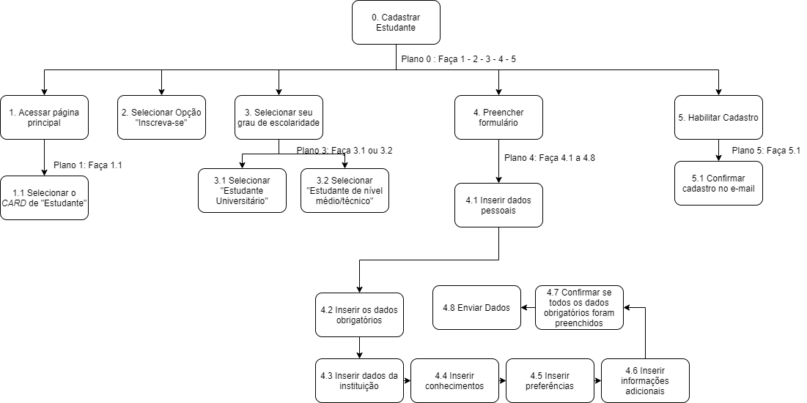
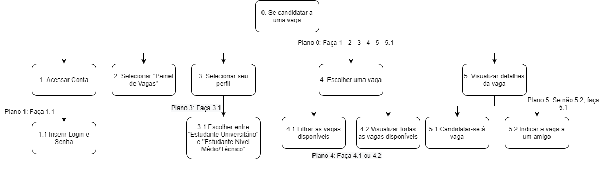
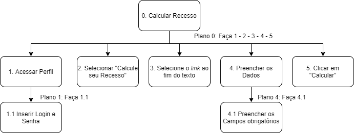
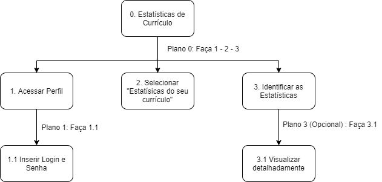
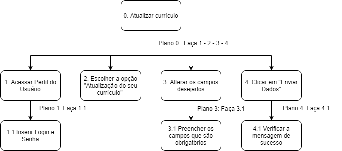

# Análise de tarefas V2

> Essa é a segunda versão da **análise de tarefas** visando corrigir as tarefas já existentes e encontrar novas tarefas para o perfil de *ESTUDANTE* e com foco na técnica de HTA.  
> [Primeira versão da Análise de Tarefas](analise_tarefas.md)

A análise de tarefas é a atividade que busca ter um etendimento sobre o trabalho dos usuário, como eles realizam este trabalho e o por quê. Nesse tipo de análise, o trabalho é definido em termos dos objetivos que os usuários querem ou precisam atingir.

Dentre os métodos de análise de tarefas mais comuns, podemos destacar:

- Análise Hierárquica de Tarefas (HTA – Hierarchical Task Analysis);
- GOMS (Goals, Operators, Methods, and Selection Rules).
- ConcurTaskTrees (CTT).

---

## Análise Hierárquica de Tarefas (HTA)

Foi desenvolvida para entender as competências e habilidades exibidas em tarefas complexas e não repetitivas, bem como para auxiliar na identificação de problemas de desempenho. Ela ajuda a relacionar o que as pessoas fazem (ou se recomenda que façam), por que o fazem, e quais as consequências caso não o façam corretamente.

     
    Fonte: Livro IHC[1] 

- Tarefa: uma tarefa é qualquer parte do trabalho que precisa ser realizada.
- Objetivo: são as ações que os usuários desejam excutar, estes são o nível mais alto da hierarquia de objetivos.
- Subobjetivos: são definidos quando um objetivo precisa executar mais de uma tarefa para ser finalizado.
- Plano: um plano define os subobjetivos necessários para alcançar um outro objetivo maior, e a ordem em que esses subobjetivos devem ser alcançados.
- Operação: uma operação é especificada pelas circunstâncias nas quais o objetivo é ativado (input ou entrada), pelas atividades ou ações (actions) que contribuem para atingi-lo e pelas condições que indicam o seu atingimento (feedback).
  - Relações entre os subobjetivos
    - 1>2: Sequêncial (objetivo deve ser atingido antes do próximo)
    - 1/2: Seleção (objetivos que deverão ser atingidos dependem das circunstâncias)
    - 1+2: Paralelo (mais de um objetivo deve ser atingido ao mesmo tempo)

### HTA01: Cadastrar estudante V2

### HTA02: Se candidatar a uma vaga V2

### HTA03: Calcular Recesso V2

### HTA04: Estatísticas do Currículo

### HTA05: Atualizar Currículo

---

## Histórico

| Data     | Versão | Descrição             | Autor(es)        |
| -------- | ------ | --------------------- | ---------------- |
| 28/10/20 | 0.1    | Criação da segunda versão da página  | Nícalo Ribeiro |
| 28/10/20 | 0.2    | Criação dos HTAs  | Nícalo Ribeiro |
| 29/10/20 | 0.3   | Revisão e Formatação da página  | Nícalo Ribeiro |

## Referências

* [1] BARBOSA, Simone; SILVA, Bruno. Interação Humano-Computador, Capítulo 8 - Princípios e Diretrizes para o Design de IHC .Rio de Janeiro – RJ: Elsevier Editora Ltda, 2010.
