# Guia de Estilo

Trata-se de um registro das principais decisões de design tomadas, de forma que elas não se percam, isto é, sejam efetivamente incorporadas no produto final. Guias de estilo servem de ferramenta de comunicação entre os membros da equipe de design e também com a equipe de desenvolvimento.

---

### 1. Introdução

#### 1.1. Objetivo do guia de estilo

O objetivo desse guia é registrar os padrões e decisões de design adotadas no site avaliado(Estagiarios.com). Dessa forma, permitindo que as decisões de design possam ser facilmente consultadas e reutilizadas nas propostas de melhoria e também na confecção de protótipos.

#### 1.2. Organização e conteúdo do guia de estilo

Esse guia é estruturado nos seguintes tópicos: 1. Introdução; 2. Resultados de Análise; 3. Elementos de Interface; 4. Elementos de Interação; 5. Elementos de Ação; 6. Vocabulário e Padrões.

#### 1.3. Público-alvo do guia de estilos

O público-alvo é nosso próprio grupo.

#### 1.4. Como utilizar o guia (em produção e manutenção)

#### 1.5. Como manter o guia

Qualquer modificação/evolução deve ser notificada e também incluída no histórico de revisão do documento.

### 2. Resultados de análise

#### 2.1. Descrição do ambiente de trabalho do usuário

### 3. Elementos de interface

#### 3.1. Disposição espacial e grid

#### 3.2. Janelas

#### 3.3. Tipografia

#### 3.4. Símbolos não tipográficos

#### 3.5. Cores

#### 3.6. Animações

### 4. Elementos de interação
 
Os principais elementos de interação do site são :  
- Links textuais clicáveis;
- Botões;    
- Cores específicas para cada tipo de usuário; 

| Tipo de usuário | Cor utilizada no elemento |
| --------------- | ------------------------- |
| Empresa         | 
#6E3795
|
| Profissional liberal | 
#B3D336
|
| Estudante | 
#F68121
 |
| Escola | 
#FFC20F
 |

**Ressaltando que haverá foco no módulo de *ESTUDANTE*, visto que é onde temos acesso dentro do site.**  

#### 4.1. Estilos de interação
Para o módulo de **estudante**, existem alguns estilos para a interação :    

### Botões
#### Botão 1
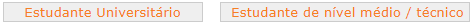  
- Esse tipo de botão é majoritário no módulo de **estudante**, presente em ações como 'Painel de Vagas' e 'Alterar Senha';  
- Mantém o padrão de cor característico para o modulo de **estudante** (#F68121) com um fundo acinzentado (#EFEFEF).  

#### Botão 2
  
- São os botões de navegação para fora do módulo de **estudante**;  
- A cor de fundo muda conforme o módulo de origem, assim como a cor da fonte;  
- No módulo de estudante, mantém a cor de fundo padrão (#F68121) e fonte branca.  

#### Botão 3
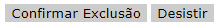  
- Esse botão foi encontrado somente na seção de 'Excluir currículo' no módulo de **estudante**;  
- Não segue nenhum padrão de cor/estilo;  
- Por se tratar de uma ação de exclusão, as cores e estilo deveriam ser no mínimo marcantes para o usuário.  

### Links
#### Link 1  
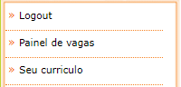  
- Compõe o menu lateral de navegação;
- São meros textos clicáveis, sem indicação visual;   
- Há apenas o indicador lateral ('>>') e a borda seguindo o padrão de cor do módulo. No caso do módulo de **estudante**, a cor é #F68121.  

#### Link 2
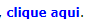  
- É encontrado nos grids correspondentes da seção selecionada pelo usuário;
- Esse link é o padrão, com fonte de cor azul;  

### Ícones

| Ícone | Uso |
| ----- | --- |
|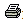| Utilizado para a impressão de algum documento (como o currículo)|
|| Utilizado para redirecionar ao site do Correios para consulta de CEP|
|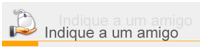| Utilizado para redirecionar a uma página para enviar um e-mail de indicação|
|| Utilizado em uma *checklist*|
|| Utilizado para compartilhar algumas páginas nas redes sociais|  

### Paginação
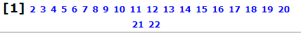  
- A paginação segue o padrão de *links*: um texto azul clicável;   
- Apesar de simples, se destaca bastante e a página atual difere das demais(ela se difere ficando em preto).   

### Campos
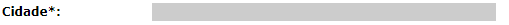    
- Os campos para inserção de dados seguem o padrão acima;  
- Há um texto indicando do que se trata e um '*' que indica obrigatoriedade;  
- O local onde a informação será deigitado possui fundo cinza (#FFFFFF) e a cor da fonte em preto;  

#### 4.2. Seleção de um estilo
- O site não segue um padrão específico de estilo;  
- Cada seção do site ( e ainda dependendo do módulo utilizado ) possui algum elemento que foge do padrão (se é que há) e tem características próprias.   
- A única parte que segue um estilo constante é o header : 
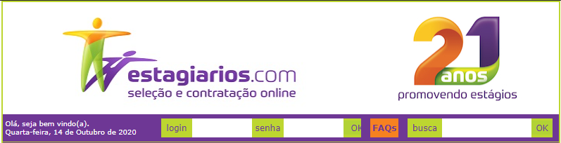  

- Como cada módulo possui uma cor característica, então seria interessante atualizar o header para se adequar à cor do módulo. Ou então seguir o padrão do header,com várias cores, em todo o site independente do módulo.

#### 4.3. Aceleradores (teclas de atalho)
O site não possui aceleradores evidentes e acabam que não são necessários.  

### 5. Elementos de ação

#### 5.1. Preenchimento de campos
- O preenchimento de campos é padronizado, tanto fonte quanto cor;  
- Alguns campos possuem preenchimento automático ( Como alguns campos de cadastro de endereço após a inserção do CEP);  
- Campos com várias opções podem possuir um filtro, como é o caso da imagem abaixo onde o campo de 'cidade' é filtrado de acordo com o 'estado' :  
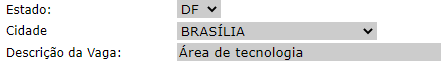 

#### 5.2. Ativação
- É possível identificar um campo ativado ou selecionado: ele fica em negrito;  
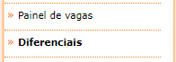
- Em alguns momentos não é possível diferenciar ativação de um texto em negrito:  
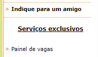

### 6. Vocabulário e padrões

#### 6.1. Terminologia
- Os vocábulos utilizados no site são um tanto quanto simples e diretos;  
- No módulo de **estudante**, o vocabulário é intuitivo e, em caso de dúvida, há sempre uma explicação em cada seção sobre o que se trata e quais as ações possíveis.
#### 6.2. Tipos de tela (para tarefas comuns)
- As telas mantém um padrão, com menu lateral à esquerda e conteúdo ao centro, no topo o banner e opções de navegação fora do módulo e, à direita, cards com algumas informações e links;  
- O menu lateral muda suas opções de acordo com o módulo do usuário;
- O conteúdo central se apresenta basicamente em forma de textos informativos ( como vagas e informações sobre leis ), formulários ( como cadastro e atualização de currículo ) e algumas ferrmentas ( como cálculo de recesso remunerado);

#### 6.3. Sequências de diálogos
- A maioria das telas são informativas ou com formulários para executar uma ação;
- As telas de executar ação necessitam apenas de um clique de botão ou preenchimento de formulário;
- Os formulários possuem 2 tipos de resposta: sucesso ou erro;
    - As mensagens de erro seguem dois padrões: alert box e texto destacado;
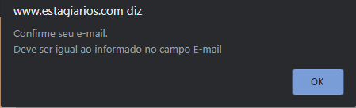
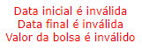  
    - As mensagens de sucesso seguem o padrão de alert box;
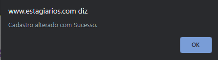
  

---

## Histórico

| Data     | Versão | Descrição                  | Autor(es)        |
| -------- | ------ | -------------------------- | ---------------- |
| 13/10/20 | 0.1    | Adição do tópicos 1, 2 e 3 | Gustavo Nogueira |
| 14/10/20 | 0.2    | Adição do tópicos 4,5 e 6 | Nícalo Ribeiro |

---

## Referências

- BARBOSA, Simone; SILVA, Bruno. Interação Humano-Computador. Rio de Janeiro – RJ: Elsevier Editora Ltda, 2010.
