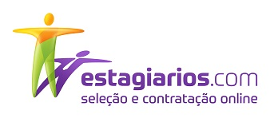
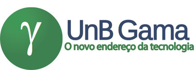

  

- - -
# Sobre o projeto

Este repositório destina-se à matéria de Interação Humano-Computador da Universidade de Brasília. O objetivo deste repositório é analisar e propor melhorias de usabilidade do site estagiarios.com.

# Sobre o site
Site serviços online relativos à seleção e contratação de Estagiários para Instituições de Ensino, Agentes de Integração, Consultorias de RH, Profissionais Liberais e Empresas concedentes de estágios, públicas e privadas.

O Site é o primeiro, e único, Prestador de Serviços do segmento a disponibilizar, online, todos os documentos e procedimentos legais que formalizam juridicamente estas contratações - inclusive o Certificado de Seguro de Acidentes Pessoais (obrigatório) - nos termos da Legislação vigente.

- - -
# Equipe

| Matrícula | Nome                           | E-mail                     | Git              |
| --------- | ------------------------------ | -------------------------- | ---------------- |
| 180119818 | Felipe Boccardi Silva Agustini | felipeb.agustini@gmail.com | Fealps           |
| 170144259 | Gustavo Nogueira Rodrigues     | gustavonr.13@gmail.com     | Gustavo-Nogueira |
| 160016169 | Nicalo Ribeiro Dourado Araujo  | nicalo63@gmail.com         | nicaloribeiro    |

- - -

  

