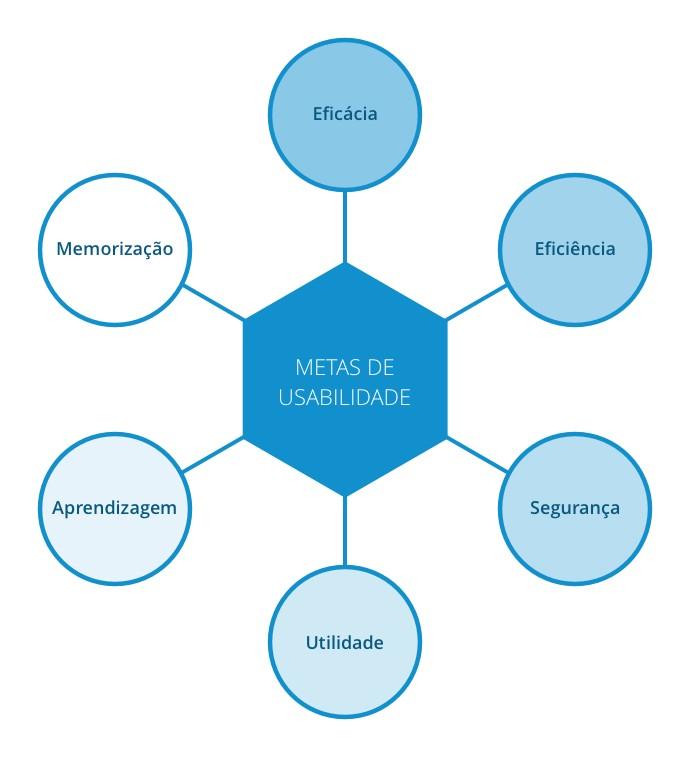

# Metas de Usabilidade
Metas de usabilidade ajudam a solucionar preocupações como a produtividade do usuário durante a utilização do sistema e a motivação desse usuário para um aprendizado eficaz. Segundo Jakob Nielsen (1993) exitem 6 metas de usabilidade, que são fatores diretamente ligados ao uso de sistema.  

**As metas de usabilidade são:**  
- Eficácia   
- Eficiência  
- Segurança  
- Utilidade  
- Aprendizagem  
- Memorização  

* A **eficácia** é uma meta bastante geral e se refere a quanto um produto é bom em fazer o
que se espera dele.  
    - Pergunta: O produto permite que as pessoas aprendam, realizem seu trabalho de forma eficiente, acessem a informação de que necessitam ou comprem os produtos que desejam?  

  
* A **eficiência** refere-se à maneira como um produto auxilia os usuários na realização de
suas tarefas.  
    - Pergunta: Os usuários conseguirão manter um alto nível de produtividade, uma vez que tenham aprendido como utilizar um produto para realizar suas tarefas?  

  
* A **segurança** envolve proteger o usuário de condições perigosas e situações indesejáveis.  
    - Pergunta: Qual é a gama de erros possíveis ao se utilizar o produto e quais as medidas que o
produto permite que o usuário tome para corrigir os erros facilmente?  

  
* A **utilidade** refere-se à medida na qual o produto oferece o tipo certo de funcionalidade,
de modo que os usuários possam fazer aquilo que precisam ou desejam.  
    - Pergunta: O produto fornece um conjunto adequado de funções que permitam aos usuários
realizar todas as suas tarefas da maneira que desejam?  

  
* A capacidade de **aprendizagem** (learnability) refere-se à facilidade de aprender a usar
um sistema.  
    - Pergunta: O usuário saberá como usar o produto explorando a interface e experimentando
determinadas ações? Será difícil aprender todo o conjunto de funções dessa maneira?  

  
* A capacidade de **memorização** (memorability) refere-se à facilidade de lembrar como utilizar um sistema depois de já tê-lo aprendido.  
    - Pergunta: Que tipos de suporte de interface foram fornecidos com o objetivo de ajudar os
usuários a lembrarem como realizar as tarefas, especialmente para produtos e operações que
são utilizados com pouca frequência?  

- - -

# Histórico

| Data     | Versão | Descrição                         | Autor(es)                                        |
| -------- | ------ | --------------------------------- | ------------------------------------------------ |
| 13/10/2020 | 0.1  | Criação da versão inicial da página |Nícalo Ribeiro |

- - -

# Referências
As 6 metas de Usabilidade. (2016). Retrieved 12 October 2020, from https://medium.com/uxcaboquinho/as-6-metas-de-usabilidade-9491442fd56a