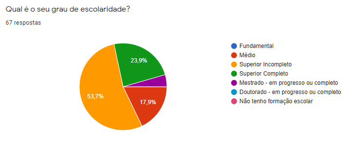
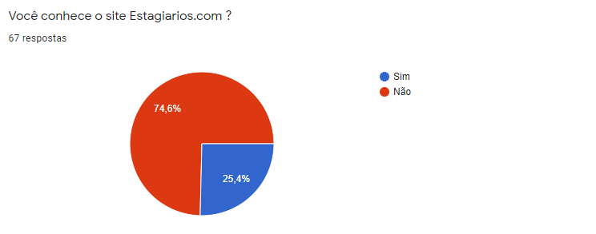
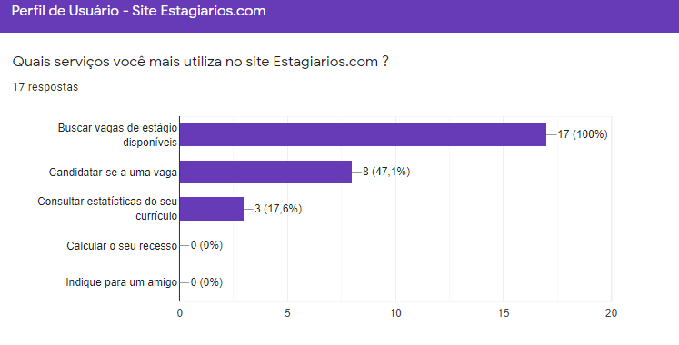
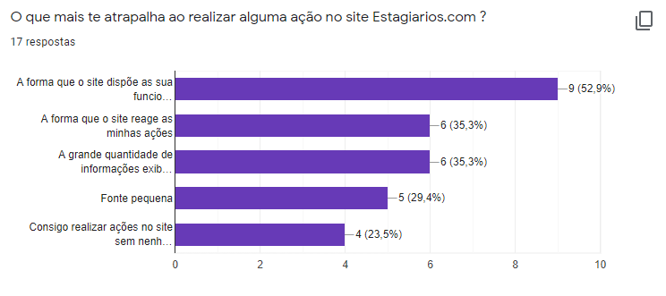
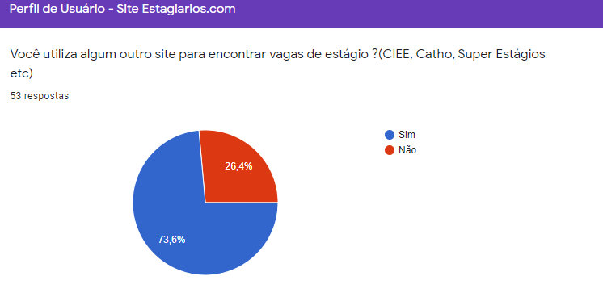

# Questionário

Os questionários são formulários compostos por perguntas, abertas ou fechadas, aplicadas a fim de coletar dados para uma avaliação, análise ou pesquisa. Semelhantes às entrevistas por possuir perguntas abertas ou fechadas, os questionários possuem a vantagem de não necessitar de um entrevistador para sua aplicação e de poder ser aplicado a um grande número de pessoas dispersas geograficamente. Essa vantagem torna-se uma desvantagem, visto que, devido à ausência de um entrevistador, as perguntas devem ser claras, objetivas e curtas e, preferencialmente, conter instruções claras de preenchimento.

---

| Resumo                                |
| ------------------------------------- |
| 67 respostas                          |
| 50,7% entre 18 - 22 anos              |
| 53,7% com ensino superior incompleto  |
| 25,4% conhecem o site Estagiarios.com |

---

## Histórico

| Data     | Versão | Descrição        | Autor(es)                         |
| -------- | ------ | ---------------- | --------------------------------- |
| 03/10/20 | 0.1    | Adição da página | Gustavo Nogueira & Nícalo Ribeiro |
